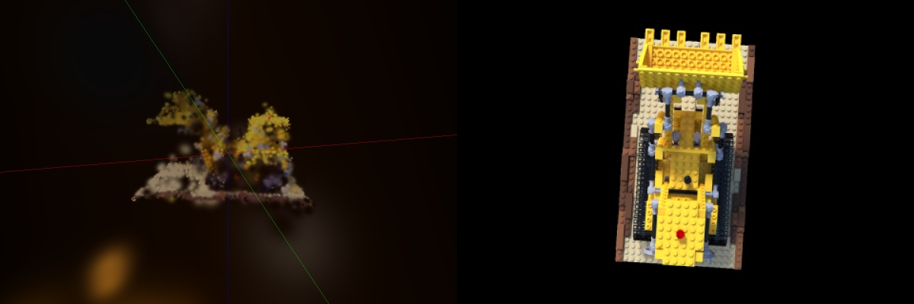

# 3D Gaussian Splatting with Apple Silicon

Add simple description and a video example. Explain that it is optimized for apple silicon chips.

## Documentation

- [Project installation](docs/installation.md)
- [Gaussian PLY format](docs/ply-format.md)
- [Dataset preparation with COLMAP](docs/dataset-preparation.md)
- [Inference pipelines](docs/inference.md)
- [Training](docs/training.md)

## References

> Bernhard Kerbl, Georgios Kopanas, Thomas Leimkuehler, and George Drettakis. 2023. 3D Gaussian Splatting for Real-Time Radiance Field Rendering. ACM Trans. Graph. 42, 4, Article 139 (August 2023), 14 pages. https://doi.org/10.1145/3592433

